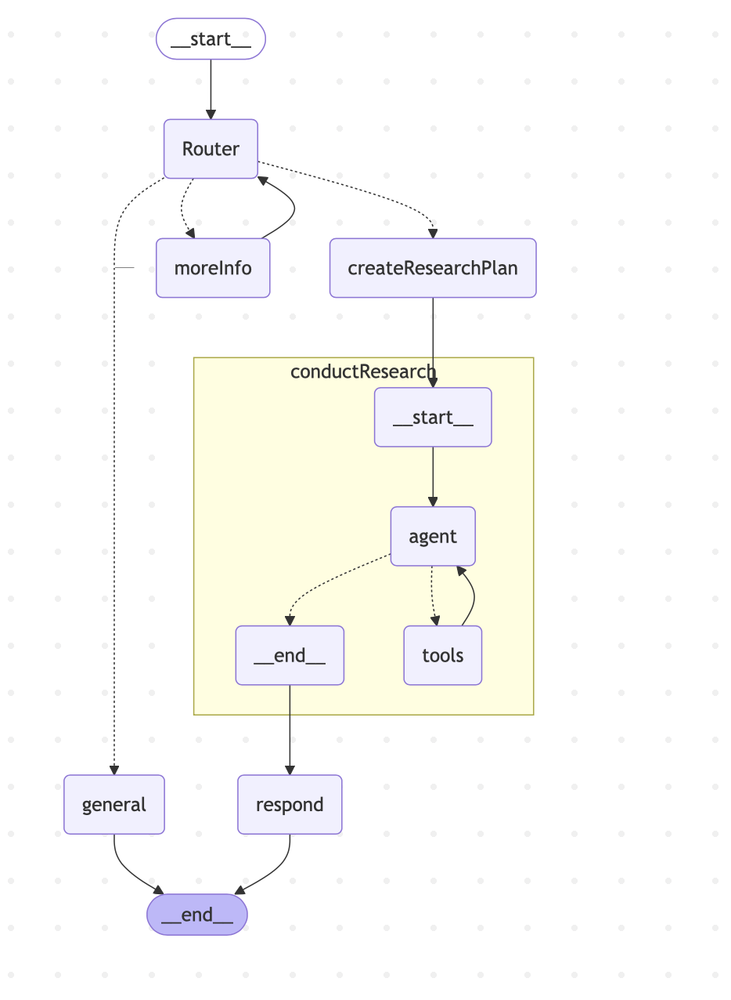

# ResearchAgent
Research Agent created using LangChain and LangGraph

This project implements a multi-agent Retrieval-Augmented Generation (RAG) system using LangChain and LangGraph. It features a graph-based workflow for research and retrieval tasks, including query analysis, research planning, document retrieval,web search and response generation.

# Images

# Features

- **Graph-Based Workflow**: Modular graph of nodes for various stages of the RAG pipeline.
- **Subgraph Support**: Retrieval is implemented as a reusable subgraph.
- **Conditional Routing**:  Logic branches based on query scope, response status.
- **Pluggable Logic**: You can easily extend or modify the tools used in the data gathering and response generation.

# How It Works

1. **Analyze Query:**: The system first analyzes the input query to determine its intent and scope.
2. **Route Query:**: Based on analysis, the query is routed to either:
    - Research Pipeline (if in scope), 
    - Immediate Response (if query is general) or
    - Require more input from user (goes back to router again).
4. **Create Research Plan:**: Generates sub-questions or a research roadmap.
5. **Conduct Research (Subgraph)**: Uses various tools for data gathering, some of them are:
    -  Web Search
    -  Retrieve Reseach Papers
    -  Retrive from vector database
6. **Final Response**: Generates final answer from the gathered data.
   
# Technologies Used

- **Python**: The core programming language for building the agent.
- **LangGraph**: Build the multi-agent graph architecture
- **LangChain**: Integrate Large Language Models and tools
- **LLM**: used llama-3.1-8b model.
  
